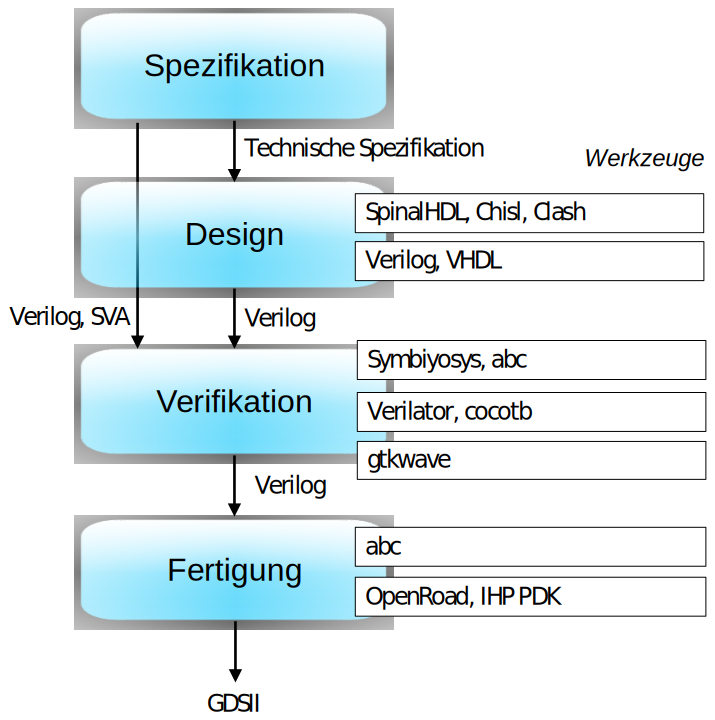

# Anforderungen an die Toolchain

## Zusammenfassung der Diskussion vom 19.02.2025, 13:00- 14:00

Zielstellung für die Studenten: es soll ein Chip entwickelt werden, der im Demonstrator (Türschloß) eine genau spezifzierten Steuerung implementiert. Die OCDC-Toolchain soll die Studenten bei dieser Entwicklung unterstützen. 

## Spezifikation

Die Aufgabenstellung erfolgt in einer Mischung aus natürlicher Sprache und technischer Spezifikation (welche PINs hat der zu entwickelnde Chip, wie ist das I/O-Verhalten, wie ist das Timing...). Die Spezifikation ist präzise genug, um daraus Testfälle abzuleiten, aber selbst noch keine formale Spezifikation. 

## Design

Das Design erfolgt auf der Basis von Verilog (Yosys-Flavour, mit Anteilen von SystemVerilog?). Alternativ kann auch SpinalHDL/Chisel eingesetzt werden, da sich daraus einfach Verilog generieren lässt. Gleiches gilt für VHDL, oder andere High-Level Sprachen (Clash?). 

## Fertigung

Aus Verilog wird mit Yosys/abc eine Netlist erzeugt, und dann mit OpenRoad und dem IHP-PDK GDS-II. 

Eingabe für OpenRoad ist Verilog zusammen mit einigen Constraints. 

Frage: 

* Was genau müssen die Studierenden abgeben ? 
* Die GDS-Datei, den Verilog-Quellcode? SpinalHDL, wenn das benutzt wurde?

## Verifikation

Die Verifikation kann auf mehreren Ebenen erfolgen:

* Auf der untersten Ebene (Netzlisten) mit Simulation und Analyse der Signale, bspw. mit GTKWave. Problem ist hierbei, den Signalen den Quellcode aus Verilog zuzuordnen.
* Testen auf Verilog-Ebene:  Verilator oder cocotb
* Verifikation durch Model-Checking: SymbiYosys

Die Studentenaufgabe sollte in einer Verifikationssprache beschreibbar sein. 

Fragen:

* Welche Verifikationssprache? SVA?
* Inwieweit wollen wir UVM unterstützen (Industrie-Standard, aber baut auf SystemVerilog auf)?
* Was benutzt efabless?

## Security-by-Design

Security-by-Design ist zu dem skizzierten Workflow orthogonal, da die verwendeten Werkzeuge auf Verilog aufbauen. Es gibt dann zusätzliche Werkzeuge für die Verifikation von Security-Eigenschaften.

## Zusammenfassung 

Hier die Phasen des Systementwurfs, die für die Übergänge verwendeten Sprachen und die innerhalb der Phasen verwendeten Werkzeuge.

